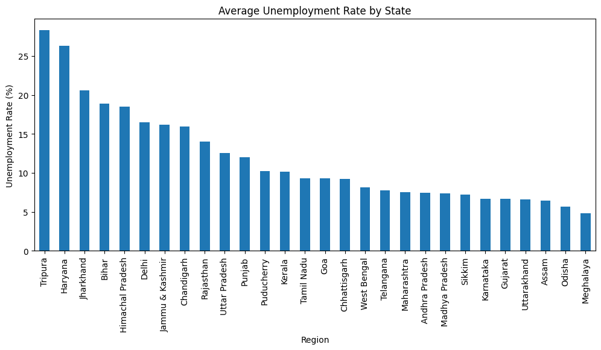
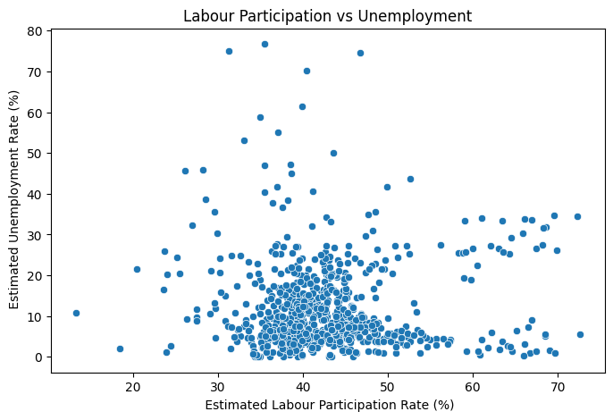
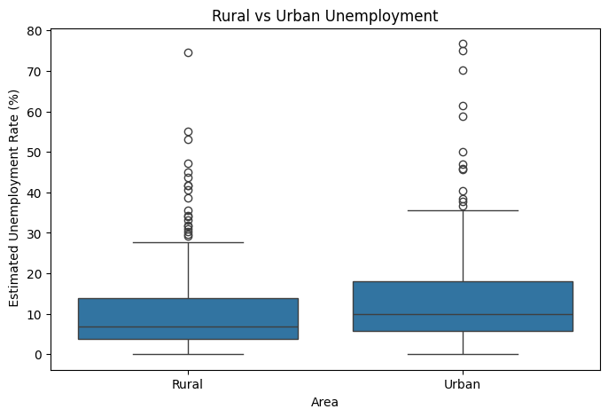
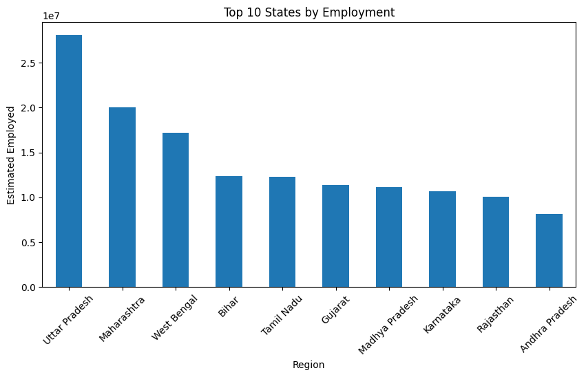

# Unemployment Analysis in India

## Project Overview

This project focuses on analyzing unemployment trends across different regions of India using data analytics and visualization techniques. The objective is to identify patterns in unemployment rates, labour participation rates, and employment distribution while deriving meaningful insights from the dataset.

The project demonstrates the practical application of exploratory data analysis (EDA) techniques to understand socio-economic indicators and support data-driven decision-making.

---

## Problem Statement

Unemployment is one of the key economic indicators that reflects the health of a country's labour market. Understanding unemployment trends can help identify regional disparities, workforce participation patterns, and employment challenges.

The objective of this project is to analyze unemployment data and visualize important trends across different states and regions of India.

---

## Dataset Information

The dataset contains unemployment statistics collected from different regions of India.

### Features

- Region
- Date
- Estimated Unemployment Rate (%)
- Estimated Employed
- Estimated Labour Participation Rate (%)
- Area (Urban/Rural)

---

## Project Workflow

Dataset Collection
        ↓
Data Loading
        ↓
Data Cleaning
        ↓
Data Exploration
        ↓
Data Visualization
        ↓
Trend Analysis
        ↓
Correlation Analysis
        ↓
Insights & Conclusions

---

## Methodology

### 1. Data Loading and Inspection

The dataset was imported into Python and inspected using descriptive statistics and structural analysis techniques.

### 2. Data Cleaning

Missing values were identified and handled appropriately to ensure data quality and consistency.

### 3. Exploratory Data Analysis

EDA techniques were applied to understand unemployment patterns, labour participation rates, and employment distribution.

### 4. Data Visualization

Several visualizations were developed, including:

- State-wise Unemployment Analysis
- Monthly Unemployment Trends
- Labour Participation Analysis
- Correlation Heatmap
- Distribution Analysis

### 5. Trend Analysis

Regional and temporal unemployment trends were examined to identify significant variations and patterns.

---

## Tools and Technologies

- Python
- Pandas
- NumPy
- Matplotlib
- Seaborn
- Google Colab

---

## Key Analysis Performed

- Unemployment Rate Analysis
- Employment Distribution Analysis
- Labour Participation Analysis
- Regional Comparison
- Monthly Trend Evaluation
- Correlation Analysis

---

## Results

The analysis provided valuable insights into unemployment trends across India and highlighted significant differences in labour market conditions among regions.

The visualizations helped identify employment patterns, workforce participation levels, and unemployment fluctuations over time.

---
# Project Visualizations

## Average Monthly Unemployment Trend

Shows variation in unemployment throughout the year.

---

## Average Unemployment Rate by State

Comparison of unemployment rates across Indian states.

---

## Correlation Heatmap

Displays relationships among unemployment rate, employment population, and labour participation rate.

.png)

---

## Distribution of Unemployment Rate

Shows overall distribution and frequency of unemployment rates.

---

## Labour Participation vs Unemployment

Analyzes the relationship between labour participation and unemployment levels.

---

## Rural vs Urban Unemployment

Compares unemployment patterns between rural and urban regions.

---

## Top 10 States by Employment

States with highest employed population.

---

## Top 10 States with Highest Unemployment Rate

Highlights states facing higher unemployment challenges.

---

## Top 10 States by Labour Participation Rate

Shows states with strongest workforce participation.

---

## Skills Demonstrated

- Data Cleaning
- Exploratory Data Analysis
- Data Visualization
- Statistical Analysis
- Trend Analysis
- Data Interpretation

---

## Conclusion

This project demonstrates how data analytics and visualization techniques can be applied to understand labour market dynamics and extract actionable insights from socio-economic datasets.
