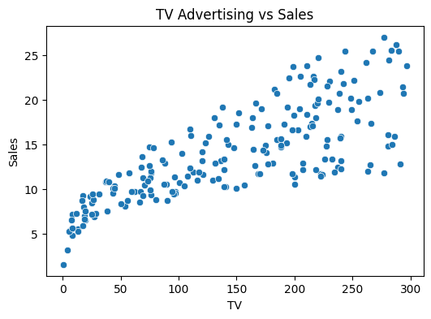
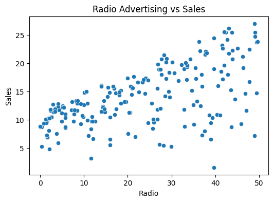
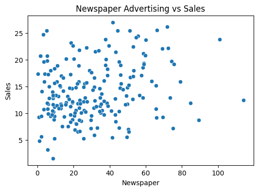
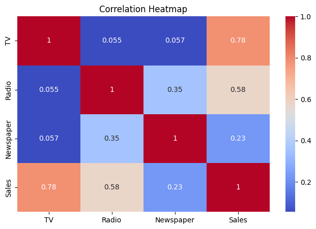
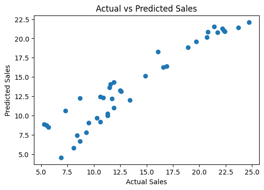

# Sales Prediction Using Python

## Project Overview

This project focuses on predicting product sales based on advertising expenditure across different marketing channels. The objective is to analyze the relationship between advertising investments and sales performance and develop a predictive model for sales forecasting.

The project demonstrates the application of machine learning techniques in business analytics and marketing decision-making.

---

## Problem Statement

Organizations invest significant resources in advertising campaigns across television, radio, and newspaper channels. Understanding the impact of these investments on sales performance is essential for optimizing marketing strategies.

The objective of this project is to develop a machine learning model capable of predicting sales based on advertising expenditure.

---

## Dataset Information

### Features

- TV Advertising Budget
- Radio Advertising Budget
- Newspaper Advertising Budget

### Target Variable

- Sales

---

## Project Workflow

Dataset Collection
        ↓
Data Loading
        ↓
Data Cleaning
        ↓
Exploratory Data Analysis
        ↓
Correlation Analysis
        ↓
Feature Selection
        ↓
Model Training
        ↓
Prediction
        ↓
Performance Evaluation

---

## Methodology

### 1. Data Preparation

The dataset was loaded, inspected, and cleaned to ensure data quality.

### 2. Exploratory Data Analysis

EDA techniques were applied to understand relationships between advertising channels and sales performance.

### 3. Correlation Analysis

A correlation heatmap was used to evaluate feature relationships and identify influential variables.

### 4. Model Development

A Linear Regression model was trained using advertising expenditure data.

### 5. Model Evaluation

The predictive performance of the model was evaluated using standard regression metrics.

---

## Machine Learning Algorithm

- Linear Regression

---

## Evaluation Metrics

- Mean Absolute Error (MAE)
- Root Mean Squared Error (RMSE)
- R² Score

---

## Tools and Technologies

- Python
- Pandas
- NumPy
- Matplotlib
- Seaborn
- Scikit-learn

---

## Results

The developed model successfully predicted sales outcomes and demonstrated a strong relationship between advertising expenditure and product sales.

The analysis highlighted the importance of marketing investments in influencing sales performance.

---
## Project Visualizations

### TV Advertising vs Sales
Analyzes the relationship between TV advertising expenditure and product sales. The scatter plot shows a strong positive correlation, indicating that higher TV advertising budgets generally lead to increased sales.

---

### Radio Advertising vs Sales
Examines the impact of radio advertising on sales performance. The visualization demonstrates a moderate positive relationship between radio advertising investment and sales.

---

### Newspaper Advertising vs Sales
Explores the relationship between newspaper advertising expenditure and sales. Compared to TV and Radio advertising, newspaper advertising shows a weaker correlation with sales.

---

### Correlation Heatmap
Displays the correlation coefficients among advertising channels (TV, Radio, Newspaper) and Sales. The heatmap helps identify which advertising medium has the strongest influence on sales performance.

---

### Actual vs Predicted Sales
Compares actual sales values with the sales predicted by the Linear Regression model. The close alignment of points indicates that the model performs well in predicting sales outcomes.

---

## Skills Demonstrated

- Data Analysis
- Data Visualization
- Regression Modeling
- Predictive Analytics
- Business Intelligence

---

## Conclusion

This project demonstrates the use of machine learning and statistical analysis techniques for sales forecasting and business decision support.
